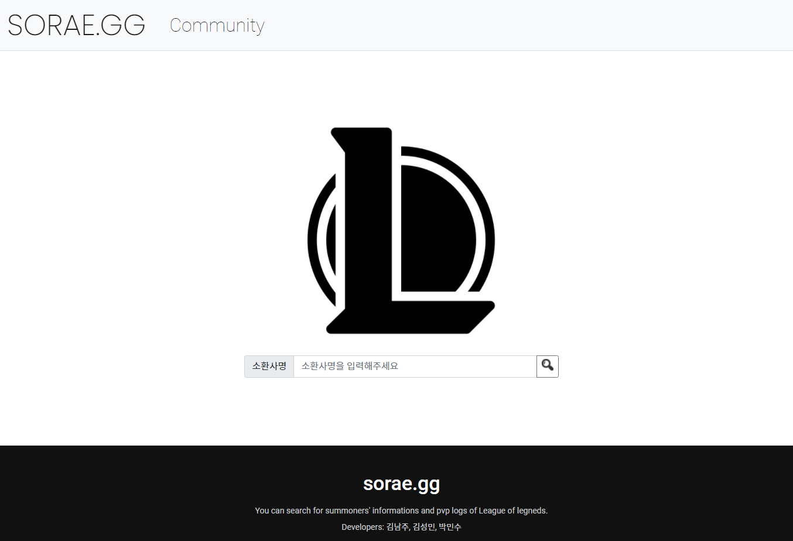
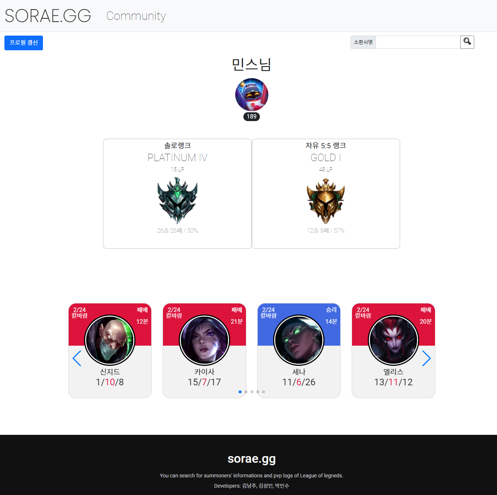
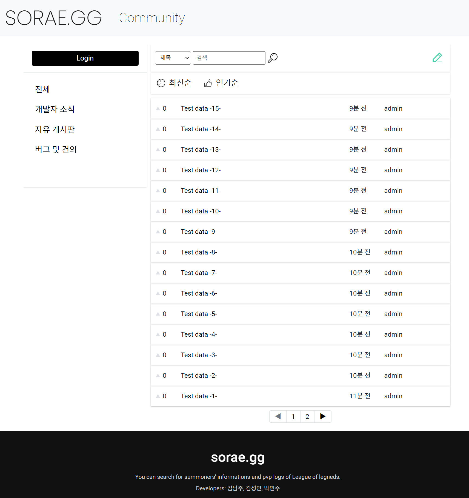
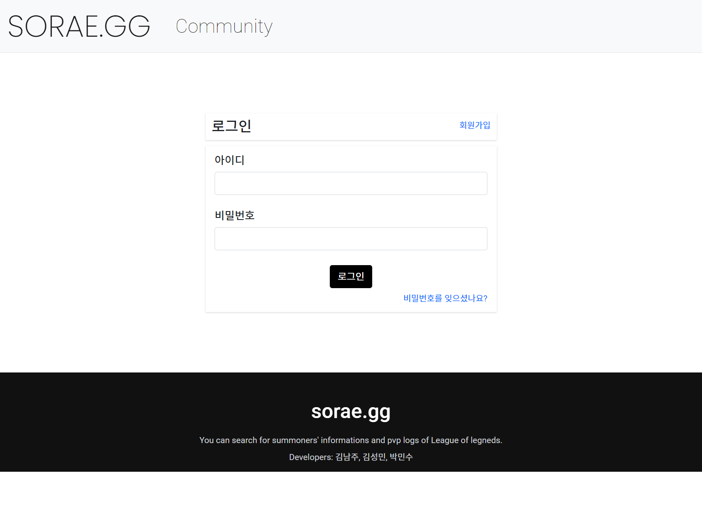
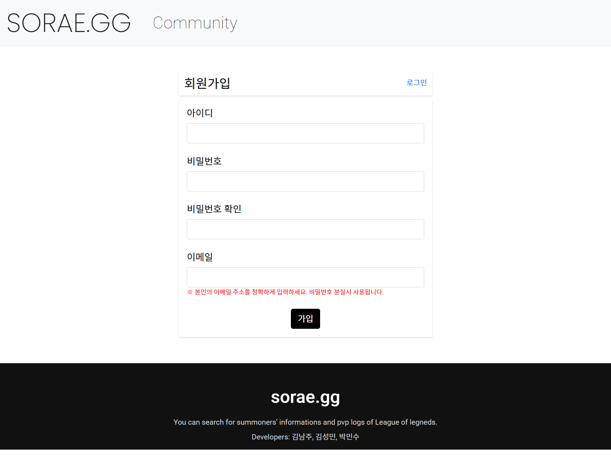
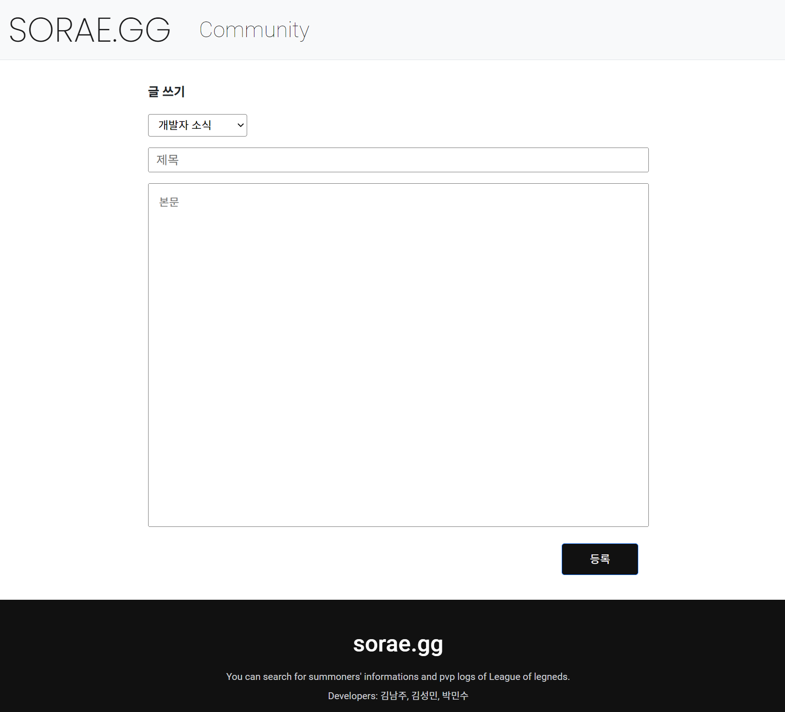
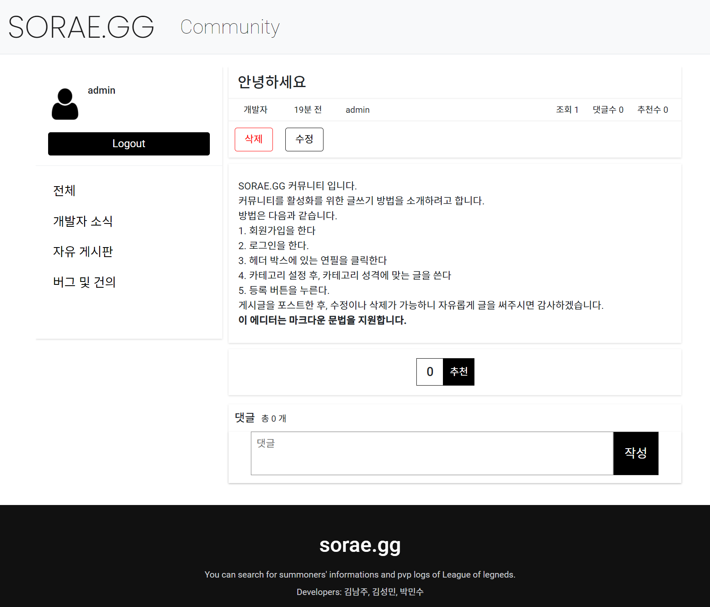

# SORAE.GG

기간 : 2022.01 ~ 2022.03

Riot API를 사용한 OP.GG 클론 웹 프로젝트

## Team

---

|                  팀원                   | 역할                                                         |
| :-------------------------------------: | ------------------------------------------------------------ |
| [김남주](https://github.com/calculus12) | 전적 페이지 UI 디자인 및 프론트엔드 개발 / 전적 검색 로직 구현 |
|   [김성민](https://github.com/fing9)    | Riot API 데이터 가공 / 스코어 알고리즘 설계                  |
|  [박민수](https://github.com/pmsu2007)  | Riot API 데이터 처리 및 DB 구축 / Community 구현             |

## Stack

---

Programming Language : 

WEB : 

## Content

---

**메인 페이지**

### 전적 기능

**소환사 전적 페이지 (갱신 버튼 클릭 시에만 갱신됨)** 

**전적 상세 정보(하단 카드 클릭 시)** 

### 커뮤니티 기능

**커뮤니티 메인 페이지** 

**로그인 페이지**

**회원가입 페이지**

**에디터 페이지**

**게시글 상세 페이지**

